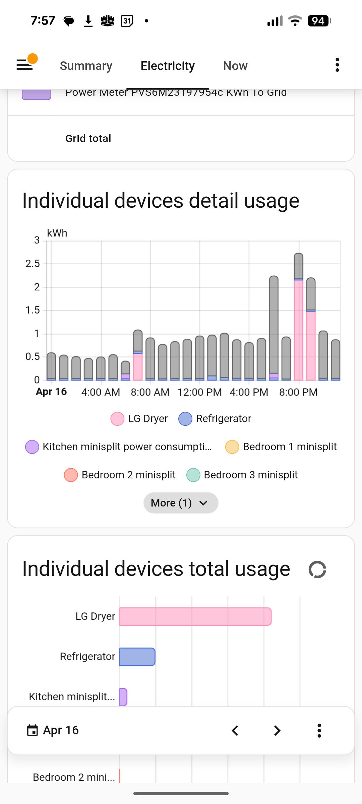
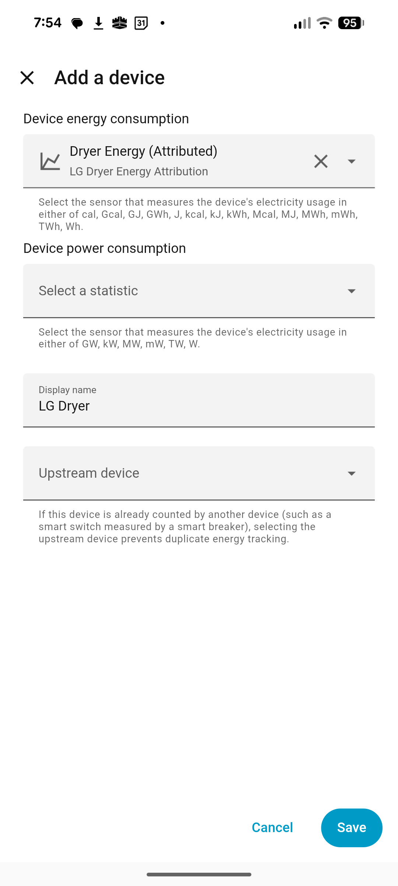

# LG Dryer Energy Attribution

A Home Assistant custom integration that accurately attributes energy consumption from an LG ThinQ dryer to the actual hours it ran, enabling proper time-of-use tracking in the Energy Dashboard.



## The Problem

The official LG ThinQ integration provides three energy sensors for washers and dryers:

- `sensor.dryer_energy_yesterday` — total Wh consumed yesterday (updated once per morning by the LG cloud)
- `sensor.dryer_energy_this_month` — cumulative Wh this month
- `sensor.dryer_energy_last_month` — total Wh last month

None of these are compatible with the Energy Dashboard out of the box. They lack the `state_class: total_increasing` attribute, and more importantly, the data arrives in a single lump hours after the dryer actually ran. If you create a `total_increasing` template sensor from `energy_this_month`, the Energy Dashboard will show a spike at the moment the LG cloud updates each morning and nothing during the actual afternoon dryer cycles.

## The Solution

This integration solves both problems:

1. **Session tracking** — Watches `sensor.dryer_current_status` for `running` and `cooling` states, recording the start and end time of every dryer cycle.

2. **Proportional attribution** — When `sensor.dryer_energy_yesterday` updates each morning with the previous day's total, the integration splits that energy across yesterday's recorded sessions proportional to their duration, further subdivided into hourly buckets.

3. **Backdated statistics injection** — Uses Home Assistant's official `async_add_external_statistics` API to write the hourly energy data with correct historical timestamps. The Energy Dashboard sees the energy in the right hours.

### Example

You run the dryer twice on Tuesday:

| Session | Time | Duration |
|---------|------|----------|
| 1 | 10:15 AM – 11:05 AM | 50 min |
| 2 | 3:30 PM – 4:45 PM | 75 min |

Wednesday morning, LG reports 4,000 Wh for Tuesday. The integration:

- Assigns 1,600 Wh (40%) to Session 1 and 2,400 Wh (60%) to Session 2
- Session 1's 1,600 Wh is split: ~720 Wh in the 10 AM hour, ~880 Wh in the 11 AM hour
- Session 2's 2,400 Wh is split: ~480 Wh in the 3 PM hour, ~1,920 Wh in the 4 PM hour
- All four hourly statistics rows are injected backdated to Tuesday

The Energy Dashboard pie chart and hourly bar graph both reflect reality.

## Requirements

- Home Assistant 2025.1 or newer (tested on 2026.4)
- The [LG ThinQ integration](https://www.home-assistant.io/integrations/lg_thinq/) configured with your WashTower or standalone dryer
- The following entities must exist:
  - `sensor.dryer_current_status` (provides: `power_off`, `initial`, `running`, `cooling`, `end`)
  - `sensor.dryer_energy_yesterday` (Wh, updated daily by LG cloud)

## Installation

### Step 1: Install via HACS (Recommended)

The easiest way to install this integration is through [HACS](https://hacs.xyz/):

1. Open HACS in Home Assistant
2. Go to **Settings → Add-ons → Custom Repositories**
3. Click the **+** button to add a new repository
4. Enter the repository URL: `https://github.com/aalkon/lg_dryer_energy`
5. Set **Category** to **Integration**
6. Click **Add**
7. Go to **Integrations** and search for "LG Dryer Energy"
8. Click **Download** and then **Install**

### Alternative: Manual Installation

If you prefer manual installation or cannot use HACS, copy the `lg_dryer_energy/` folder into your Home Assistant `custom_components/` directory:

```
config/
├── custom_components/
│   └── lg_dryer_energy/
│       ├── __init__.py
│       └── manifest.json
├── configuration.yaml
└── packages/
    └── dryer.yaml
```

### Step 2: Add configuration

If you use a packages directory (recommended), create `packages/dryer.yaml`:

```yaml
lg_dryer_energy:
  status_entity: sensor.dryer_current_status
  energy_yesterday_entity: sensor.dryer_energy_yesterday
  active_states:
    - running
    - cooling
```

Make sure your `configuration.yaml` includes the packages directory:

```yaml
homeassistant:
  packages: !include_dir_named packages
```

Alternatively, add the `lg_dryer_energy:` block directly to `configuration.yaml`.

### Step 3: Restart Home Assistant

After restarting, check the logs for:

```
[lg_dryer_energy] Loaded 0 stored sessions, cumulative=0.000 kWh
```

This confirms the integration loaded successfully.

### Step 4: Add to Energy Dashboard

This step can only be completed after the first data point has been injected — which happens the morning after the first dryer run with the integration installed. Run the dryer, wait for the next morning's LG cloud update, then proceed.

1. Go to **Settings → Dashboards → Energy**
2. Under **Individual Devices**, click **Add device**
3. In the **Device energy consumption** field, type or paste:
   ```
   lg_dryer_energy:dryer_energy_attributed
   ```
   It will appear as **"Dryer Energy (Attributed) — LG Dryer Energy Attribution"**. Select it.
4. Leave **Device power consumption** blank
5. Optionally set a **Display name** (e.g., "LG Dryer")
6. Leave **Upstream device** blank (unless your dryer is behind a smart plug that's already being tracked, in which case select that plug to avoid double-counting)
7. Click **Save**

> **Note:** This is an external statistic, not a regular `sensor.*` entity. It won't appear in the dropdown by default — you need to type or paste the statistic ID `lg_dryer_energy:dryer_energy_attributed` into the search field.



## Configuration Options

| Key | Default | Description |
|-----|---------|-------------|
| `status_entity` | `sensor.dryer_current_status` | Entity that reports dryer state (running, cooling, etc.) |
| `energy_yesterday_entity` | `sensor.dryer_energy_yesterday` | Entity that reports yesterday's total energy in Wh |
| `active_states` | `["running", "cooling"]` | Which states count as "dryer is consuming energy" |

### Entity name differences

Your entities may have a different prefix depending on how the LG ThinQ integration named your device. Check **Settings → Devices → [your dryer]** to find the exact entity IDs. Common variations:

- `sensor.dryer_current_status` / `sensor.lg_dryer_current_status`
- `sensor.washtower_dryer_current_status`

Update the configuration to match your actual entity IDs.

## How It Works (Technical Details)

### Session Tracking

The integration listens for state changes on the status entity. A "session" starts when the state enters any of the `active_states` and ends when it leaves. Sessions are persisted to `.storage/lg_dryer_energy.sessions` so they survive Home Assistant restarts.

If Home Assistant was down when the dryer started, the integration checks the current state on startup and begins a new session from that moment. You'll lose the minutes between the actual dryer start and HA coming back online, but the proportional attribution still works correctly since all tracked sessions are scaled to fill the full daily energy total.

### Energy Attribution

When `energy_yesterday` changes to a positive value (the LG cloud morning push — timing varies by region):

1. Find all recorded sessions that overlap with "yesterday" (midnight to midnight, local time)
2. Clip sessions to yesterday's boundaries (a session spanning midnight gets split across days)
3. Calculate each session's share of total energy: `session_kwh = total_kwh × (session_duration / total_duration)`
4. For sessions spanning multiple hours, further split proportionally across hour boundaries
5. Read the last cumulative sum from HA's statistics database for continuity
6. Inject `StatisticData` rows via `async_add_external_statistics`, each with the correct backdated `start` timestamp and a monotonically increasing `sum`

### Fallback Behavior

If `energy_yesterday` reports a positive value but no sessions were recorded for yesterday (e.g., Home Assistant was down all day, or the status entity wasn't working), the entire amount is attributed to noon yesterday. This prevents data loss at the cost of time accuracy for that day.

### Data Persistence

Session data and the running cumulative kWh total are stored in:

```
config/.storage/lg_dryer_energy.sessions
```

This file is automatically managed. Sessions older than 7 days are garbage collected. You can safely delete this file to reset the integration's state — the cumulative sum will restart from whatever the statistics database already has.

## Optional: Simple Fallback Sensor

If you want a simpler sensor that works immediately (without waiting for session tracking), add this to your `packages/dryer.yaml`:

```yaml
template:
  - sensor:
      - name: "Dryer Energy Total"
        unique_id: dryer_energy_total_increasing
        unit_of_measurement: "kWh"
        device_class: energy
        state_class: total_increasing
        state: >
          
          
            {{ (val / 1000) | round(3) }}
          
            {{ this.state | default('unavailable') }}
          
```

This creates a `total_increasing` sensor from `energy_this_month` that the Energy Dashboard can consume directly via **Settings → Dashboards → Energy → Individual Devices → Add**. It handles the monthly reset gracefully. The trade-off is that all energy appears at the moment the LG cloud updates  rather than at the actual run time.

> **Important:** Do not add both the attributed statistic and this fallback sensor to the Energy Dashboard simultaneously — you will double-count dryer energy.

## Troubleshooting

### The statistic doesn't appear in Energy Dashboard

- It only appears after the first data point is injected. Run the dryer, wait for the next morning's `energy_yesterday` update, then check.
- Make sure the integration loaded: search the logs for `lg_dryer_energy`.
- Check that your entity IDs are correct in the configuration.

### Energy shows as 0 or missing for a day

- If Home Assistant was restarting during the dryer run, the session may not have been captured. Check the logs for "no dryer sessions" warnings.
- If `energy_yesterday` updated to 0, there's nothing to attribute. Verify in the LG ThinQ app that energy data is available.

### Cumulative total looks wrong

Delete `.storage/lg_dryer_energy.sessions` and restart. The integration will rebuild the cumulative sum from the statistics database on the next morning update.

### Enable debug logging

Add to `configuration.yaml`:

```yaml
logger:
  logs:
    custom_components.lg_dryer_energy: debug
```

This will log every session start/end, the attribution calculation, and each hourly statistics row injected.

## Extending to the Washer

If your WashTower also has a washer with energy sensors, you can duplicate this integration for the washer by:

1. Copying `lg_dryer_energy/` to `lg_washer_energy/`
2. Find-and-replacing `dryer` with `washer` in all files (including `manifest.json` domain, `STATISTIC_ID`, `STORAGE_KEY`, and entity defaults)
3. Adding a second config block:

```yaml
lg_washer_energy:
  status_entity: sensor.washer_current_status
  energy_yesterday_entity: sensor.washer_energy_yesterday
  active_states:
    - running
    - rinsing
    - spinning
```

A future version may support multiple appliances from a single integration.

## Acknowledgments

This integration was inspired by and builds on techniques demonstrated in several community projects:

- **[ha-historical-sensor](https://github.com/ldotlopez/ha-historical-sensor)** by [@ldotlopez](https://github.com/ldotlopez) — A library for building Home Assistant integrations that inject historical statistics via the official `async_add_external_statistics` API. This project demonstrated that backdating energy data to the correct hours was possible and forward-compatible with HA updates.
- **[Home-Assistant-Import-Energy-Data](https://github.com/patrickvorgers/Home-Assistant-Import-Energy-Data)** by [@patrickvorgers](https://github.com/patrickvorgers) — Showed that writing historical data into HA's statistics tables works reliably for the Energy Dashboard, supporting both hourly and daily resolution imports.
- **[herveja/homeAssistant](https://github.com/herveja/homeAssistant)** by [@herveja](https://github.com/herveja) — The Gazpar integration's pyscript for inserting long-term statistics provided a clear, minimal example of calling `async_add_external_statistics` with `StatisticData` rows to backdate energy data to the correct day.

## License

MIT. Use at your own risk. This integration writes to Home Assistant's statistics database via the official API, but bugs could theoretically produce incorrect energy data. Keep backups.
