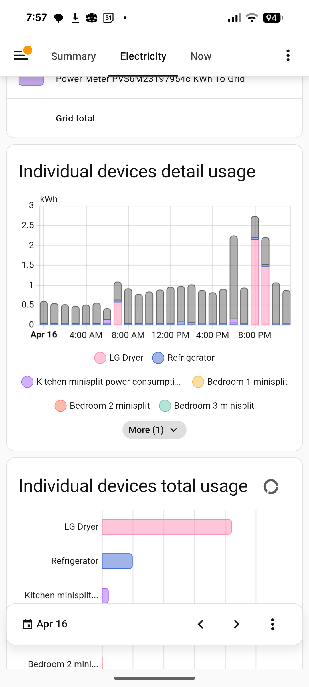

# LG Dryer Energy Attribution

A Home Assistant custom integration that **estimates hourly dryer energy** from LG ThinQ totals and recorded operating periods. It writes backdated external statistics for the Energy Dashboard.



## What it does

LG's native **Energy today** sensor can update during the day, but Home Assistant normally records its increases when they arrive. A cycle at 8:38–8:49 AM might therefore appear in the 9 AM bar when the next poll delivers its consumption.

This integration:

1. Records periods where your dryer is `running` or `cooling`.
2. Uses **Energy today**, when available with a valid local-date `last_reset`, for provisional attribution after the dryer stops. Positive increases are split over newly completed sessions according to duration. Earlier increments keep their earlier allocation.
3. Uses the native **Energy yesterday** entity's existing LG connection to verify the previous date's daily total. It requires a detailed API row with the requested `usedDate`, replaces the provisional amount (including lower or explicit zero corrections), and rewrites later cumulative sums to avoid double-counting.
4. Falls back to yesterday-only attribution if the today sensor is absent, disabled in this integration, unavailable, or lacks a usable reset date.

The native monthly sensor is **not** an attribution input. A monthly total does not identify which missing day or cycle used the energy.

**These are estimates, not measured hourly consumption.** Energy totals come from LG, but runtime does not reveal changes in heater power, cooling consumption, or load/program differences. Time-of-use cost estimates inherit that uncertainty.

LG's detailed DAILY endpoint supplies totals associated with dates. The hourly distribution here is estimated from observed operating periods; API capabilities may differ between models.

## Requirements

- Home Assistant **2026.7 or newer** and its official LG ThinQ integration.
- A dryer status sensor and an enabled, native LG **Energy yesterday** sensor. A template or copied sensor cannot supply the existing LG connection needed for verification.
- **Energy today** is optional; missing it does not prevent next-day attribution.
- Recorder enabled. No additional LG credentials are required. A read-only daily API request verifies yesterday's date; retries and checks prompted by changed native values are limited to once an hour while the integration is running.

## Installation and upgrade

Add `https://github.com/aalkon/lg_dryer_energy` as a custom **Integration** repository in HACS, then download LG Dryer Energy Attribution. Alternatively, copy the entire `custom_components/lg_dryer_energy` directory (including `ledger.py` and `source.py`) into your HA `custom_components` directory.

Add to `configuration.yaml` or an existing package:

```yaml
lg_dryer_energy:
  status_entity: sensor.dryer_current_status
  energy_today_entity: sensor.dryer_energy_today
  energy_yesterday_entity: sensor.dryer_energy_yesterday
  active_states:
    - running
    - cooling
```

Restart Home Assistant after installing. On upgrade, existing YAML remains valid; the default today entity is used automatically if present. For a renamed device, set `energy_today_entity` to its actual entity ID. Set it to `null` to keep yesterday-only behavior.

**Back up HA before upgrading.** Version 0.2.0 migrates the existing session storage to version 3. Keep that storage and the recorder database together when restoring or rolling back; an older integration cannot read the new storage format.

In **Settings → Dashboards → Energy → Individual devices**, select:

```
lg_dryer_energy:dryer_energy_attributed
```

Its name remains **Dryer Energy (Attributed)**. Existing dashboard configuration needs no change. The statistic appears after the first successful energy attribution. It is an external statistic, not a sensor entity. Do not add the native today/monthly sensor as a second entry for the same dryer: doing so double-counts its energy.

## Configuration

| Option | Default | Purpose |
|---|---|---|
| `status_entity` | `sensor.dryer_current_status` | Dryer operating status |
| `energy_today_entity` | `sensor.dryer_energy_today` | Optional provisional source; `null` disables it |
| `energy_yesterday_entity` | `sensor.dryer_energy_yesterday` | Native LG entity used to verify the prior date's total |
| `active_states` | `[running, cooling]` | States counted as active runtime |
| `total_time_entity` | `sensor.dryer_total_time` | Restart-time session reconstruction |
| `remaining_time_entity` | `sensor.dryer_remaining_time` | Restart-time session reconstruction |

Native sensor values may use Wh or kWh. Negative, non-finite, restored, and unavailable sensor values are ignored. Yesterday's authoritative API response is in Wh and must contain exactly one row matching the requested date. **An explicit zero is valid**; a missing row is not treated as zero.

One appliance is supported per installation. The existing statistic ID and storage key are shared, so do not configure multiple copies for different appliances under the same domain.

## Allocation and reconciliation

A 543 Wh increase reported at 9:36 AM after a single 8:38–8:49 AM session becomes 0.543 kWh in the 8 AM hour. If a later cycle increases the daily total to 1,543 Wh, the new 1,000 Wh is assigned to newly completed activity. If several cycles finish between reports, their share is estimated from duration.

A correction with no new sessions rescales the existing allocation. Yesterday's total is authoritative for the amount; the previously estimated hourly shape is retained where possible. When no sessions exist, today's total is held pending. If yesterday still has no sessions, energy is assigned to **local noon** as an explicitly imprecise fallback. Missing some sessions can still bias attribution; the integration cannot reconstruct unobserved consumption from a daily total.

Open sessions are not provisionally assigned energy until they end. This avoids treating an unfinished overnight cycle as a completed cycle on the wrong reporting day. Unavailable status does not end a session. Session starts and ends use the status transition timestamp, even if database or network work delays handling it. On restart, the integration can estimate a missing start from LG timer sensors or recorder history. If a persisted session ended while HA was offline, its end time is only an estimate.

### Midnight and daylight saving time

The existing **cycle-end-date model** is retained: a completed session belongs to its local completion date, while its estimated energy is distributed over its full runtime, including hours before midnight. This assumption needs validation for each LG model.

Hours are split in UTC using elapsed time and displayed by HA in its configured timezone. Crossing UTC midnight does not reset a New York reporting day. DST repeated/skipped local hours remain distinct UTC buckets. Local daily totals may differ from LG's totals when overnight energy is distributed back across midnight.

Today readings are accepted only when `last_reset` identifies the current HA local date. A stale previous-day value is not treated as today's consumption. Yesterday's native sensor provides **no source-date or successful-fetch marker**. Normal LG coordinator updates can republish its cached value and advance `last_reported`, so that timestamp is never used as proof of freshness. A date-specific read through the existing LG SDK connection must return a matching `usedDate` before reconciliation. Missing rows, wrong dates and failed requests leave prior attribution intact. Correct HA timezone configuration and agreement with LG's reporting timezone are required.

### Recovery and persistence

The ledger in `.storage/lg_dryer_energy.sessions` retains a bounded recent reconciliation window; older allocations are folded into its cumulative baseline. Completed sessions are retained for 14 days. Positive today readings with no sessions stay pending until next-day fallback.

A persisted write intent is saved atomically and read back from the actual storage file before statistics are queued. This detects failures which HA's storage helper logs without raising. Imports rewrite the full retained suffix, including zero rows for removed allocations and corrected cumulative sums for later days. Recorder results are checked before clearing the intent. Failed imports retry on the next refresh or restart. Import/replay waits until Home Assistant has fully started so setup cannot block on recorder's startup queue.

The integration checks **cached HA states once a minute**, as well as reacting to state changes. Yesterday verification normally makes one additional read-only LG request per date, plus a fresh check after restarting the integration. A changed native yesterday value can prompt another check; failed or malformed responses retry, with all attempts limited to once an hour during that run. Successful results are cached by their requested date, so identical totals on consecutive days still receive separate verification. No appliance commands are sent. The native today sensor keeps its usual polling schedule.

During upgrade, v2 days already processed are preserved as historical data and are not re-attributed. Existing totals are read from recorder even after long idle periods. **Do not delete the storage file to reset the integration.** If statistics exist without their accounting storage/migration marker, attribution stops rather than risk double-counting. Restore a matching backup.

If HA misses an entire day's reporting window, native today/yesterday sensors cannot recover arbitrary older daily totals. This version does not query historical LG data or use monthly differences to invent missing daily allocations.

## Troubleshooting

- **No same-day data:** check the today entity ID, units, value, and `last_reset`. Wait until the dryer stops and LG reports a positive total. Yesterday-only attribution remains available.
- **No updates after migration:** inspect logs for storage or recorder errors. Preserve both the storage file and recorder data for diagnosis.
- **Yesterday cannot be verified:** ensure `energy_yesterday_entity` identifies an enabled sensor from the official LG integration. API or response-validation failures retain earlier attribution and retry; same-day estimates can continue. This adapter depends on HA's LG entity and SDK interface and may need updating if those interfaces change.
- **Source and chart dates disagree:** check timezone settings and overnight sessions; completion-day totals and estimated hour-of-use totals can differ.
- **InfluxDB:** native sensor changes may be exported separately, but these backdated external statistics are not ordinary sensor events and are not automatically exported by the standard InfluxDB integration.

```yaml
logger:
  logs:
    custom_components.lg_dryer_energy: debug
```

## Development

Run `python -m pytest tests -q` after installing `pytest`, `pytest-asyncio`, and `tzdata` (on Windows). Tests use lightweight HA stubs, file-backed storage with HA's log-and-return failure behavior, and an in-memory recorder implementing historical row replacement. They cover observed-cycle attribution, reconciliation, startup/retry, migration, silent storage failures, delayed status events, midnight/DST, and dated API response validation. They are not a substitute for live recorder validation after deployment.

## Acknowledgments

Historical-statistics techniques were inspired by [ha-historical-sensor](https://github.com/ldotlopez/ha-historical-sensor), [Home-Assistant-Import-Energy-Data](https://github.com/patrickvorgers/Home-Assistant-Import-Energy-Data), and [herveja/homeAssistant](https://github.com/herveja/homeAssistant).

## License

MIT.
